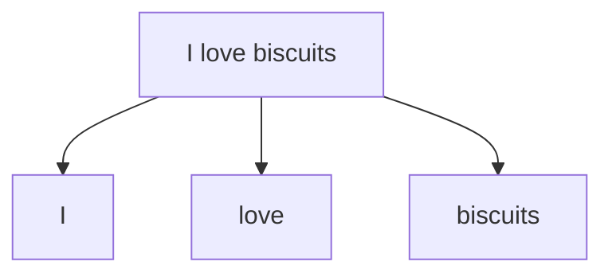

## Introduction

Les services de messagerie électronique, tels que Gmail, Outlook, ou Yahoo, sont devenus indispensables pour la communication rapide d’informations et de documents. Cependant, le courrier indésirable, ou spam, représente un défi de taille pour ces canaux de communication. Envoyé souvent par des réseaux automatisés (botnets), le spam envahit les boîtes de réception dans le but de promouvoir des produits, de mener des activités frauduleuses, ou de voler des informations. Ce flux continu de courriels indésirables réduit l’efficacité des échanges et expose les utilisateurs à des risques accrus de sécurité.

La détection de spam ne se limite pas aux emails personnels et professionnels. Elle a également des applications critiques dans plusieurs autres domaines numériques :
- Les messageries instantanées : filtrage des messages indésirables
- Les réseaux sociaux : détection de contenus inappropriés

Ces applications montrent l’importance de disposer de modèles efficaces de détection de spam, qui contribuent non seulement à la sécurité, mais également à la fluidité des interactions en ligne.

Une des principale difficulté de la détection du spam réside dans la capacité de distinguer les courriels légitimes des messages indésirables, d'autant plus que le spam prend de nombreuses formes pour contourner les filtres de sécurité.

Cette tâche de classification des emails repose sur des méthodes de traitement automatique du langage naturel (NLP) et des techniques d'apprentissage automatique pour regrouper et catégoriser les messages de façon précise.

Dans ce projet, nous utilisons les bibliothèques de traitement du langage naturel spaCy et NLTK ainsi que 3 algorithmes d'apprentissage automatique : l'algorithme de Bayes naïf, la régression logistique et Support Vector Machine; avec Python afin d'entraîner un classifieur binaire à détecter les courriels indésirables sur un jeu de données labellé.

:::{note}
L'implémentation des modèles est consultable à la fin de ce document.
:::

## Source des données

Les données sont issues d'un jeu de données disponible sur [Kaggle](https://www.kaggle.com/datasets/rajnathpatel/multilingual-spam-data/). Il contient $5672$ mails en anglais, français, allemand et Hindi. La langue originale des mails semble être l'anglais. Chaque mail est labellisé comme étant un spam ou un ham :
- $4825$ mails sont classifiés en `ham`
- $847$ mails sont classifiés en `spam`

Le mot `ham` est utilisé pour décrire les emails qui sont authentiques et qui ne sont pas considérés comme du spam.

:::{table} Extrait du jeu de donnée original
:label: table_original_data_head1
:align: center

:::

Le jeu de données est filtré afin de ne considérer que les mails écrit en Français :

:::{table} Extrait du jeu de donnée d'intérêt
:label: table_data_head1
:align: center

:::

## Bases théoriques

### Classification binaire

La classification binaire est un type de problème de machine learning supervisé dans lequel l'objectif est de classer les données en deux catégories distinctes. Chaque exemple dans les données est ainsi étiqueté comme appartenant à l'une des deux classes possibles. Dans le contexte de la détection de spam, notre modèle de classification binaire prédit si un email est un **ham** (authentique) ou un **spam** (indésirable), en utilisant les valeurs `{0, 1}` : `0` pour un **ham** et `1` pour un **spam**.

### Classes déséquilibrées

Expliquer les problèmatiques liées aux classes déséquilibrées :
- moins de données d'apprentissage pour certaines classe -> - le modèle n'apprend pas suffisamment à distinguer la classe minoritaire
- la précision est biaisée car la classe majoritaire (ham) est sureprésentée
Mention des techniques de rééquilibrage des classes (sous-échantillonnage, sur-échantillonnage, SMOTE)

### Prétraitement des données

Le pré-traitement des données répond à de nombreux objectifs :
- Nettoyer les données inutiles, redondantes ou même nuisible pour l'entraînement du modèle
- Transformer les données textuelles en données numériques exploitables par les algorithmes de machine learning. Ici en particulier, les données d'entrées du classifieur doivent être de même dimension.
- Réduire la dimensionnalité des données pour améliorer les performances des modèles
- Normaliser les données pour les rendre comparables et cohérentes
- Équilibrer les classes pour éviter les biais de prédiction

Ces étapes d'entraînement seront appliquées aux données d'entraînement lors de la phase d'entraînement du modèle et aux données de test lors de la phase d'évaluation du modèle.

:::{attention}
Certaines étapes de pré-traitement utilisent des informations des données fournies pour appliquer des transformations au jeu de données. C'est par exemple le cas lorsque l'on normalise des valeurs numériques : on a besoin de connaître la moyenne et l'écart-type des données pour les normaliser. 

Si on applique ces transformations sur l'ensemble des données (entraînement et test) avant de séparer les données, on risque de biaiser les résultats du modèle car il aura accès à des informations des données de test lors de l'entraînement. Il est donc important de séparer les données en deux jeux distincts : un jeu d'entraînement et un jeu de test. Le jeu d'entraînement est utilisé pour entraîner le modèle, tandis que le jeu de test est utilisé pour évaluer les performances du modèle sur des données non vues.
:::

Ces étapes de pré-traitement sont réalisées au sein d'une pipeline `scikit-learn` qui permet de chaîner les différentes étapes de traitement des données et de les appliquer de manière cohérente. Et ainsi de réduire le risque de fuites de données entre les jeux d'entraînement et de test.

Ci-dessous sont présentées les différentes étapes de pré-traitement des données textuelles appliquées dans ce projet.

#### Nettoyage des données

Le texte contient des entités HTML. Ceux-ci sont transformés dans leur forme lisible. Par exemple `&eacute;` est transformé en `é`.

La suppression des mots d'arrêt (stop words) élimine les mots fréquents mais peu informatifs pour la classification, tels que « et », « de », « le ». Leur retrait réduit le volume de données à traiter, ne conservant que les mots porteurs de sens pour l’analyse.

#### Tokenisation 

La tokenisation est le processus de division du texte en unités linguistiques appelées tokens (mots individuels, phrases, ou autres). Cette étape est essentielle pour capturer les caractéristiques pertinentes du texte et préparer les données pour la vectorisation et la modélisation.

#### Stemming et Lemmatisation

Le stemming et la lemmatisation sont deux techniques utilisés pour réduire des mots à leur forme de base. Cela aide à simplifier les texte.

Le stemming est une technique de traitement des mots qui consiste à supprimer les suffixes (et parfois les préfixes) pour ne conserver que la racine du mot. Cette méthode n’analyse pas le sens des mots, ce qui peut entraîner des erreurs de syntaxe. Son objectif est de simplifier les mots en réduisant les variations morphologiques, mais sans distinction de sens contextuel.

La lemmatisation vise à ramener les mots à leur forme de base, appelée lemme, telle qu’elle apparaît dans le dictionnaire. Contrairement au stemming, la lemmatisation prend en compte la grammaire et le contexte d’usage, permettant d’identifier la forme correcte d’un mot en fonction de son rôle dans la phrase. Elle nécessite donc une compréhension linguistique plus approfondie.

:::{image} ./assets/combined.png
:alt: Stemming vs Lemmatisation
:width: 700px
:::

Le stemming est plus rapide à utiliser que la lemmatisation, mais il est moins précis au niveau de la structure des mots.

#### Vectorisation des textes

La vectorisation consiste à convertir les textes en une représentation numérique vectorielle exploitable par les algorithmes de machine learning. Une des méthodes couramment utilisées consiste à associer à chaque mot un index unique, et à compter le nombre de fois que chaque mot apparaît dans chaque texte. On normalise ensuite ces comptes pour obtenir des vecteurs de fréquences de mots de taille fixe.

:::{image} ./assets/n-gram.png
:alt: N-gram illustration
:width: 600px
:::

#### Utilisation de la fréquences des mots pour normaliser les données

TF-IDF, ou *Term Frequency-Inverse Document Frequency*, est une technique très courante en NLP pour évaluer l'importance d'un terme dans un document au sein d'une collection de documents (corpus).

L'idée est de mettre en avant les termes les plus informatifs et originaux d'un texte, tout en réduisant l'impact des mots courants qui n’apportent pas de distinction au sein du corpus. Pour cela, on calcule deux valeurs :

- La fréquence du terme dans le document (TF) : le nombre de fois que le terme apparaît dans le document, divisé par le nombre total de termes dans le document.
$$
\text{TF}(t, d) = \frac{f_{t,d}}{\sum_{t' \in d} f_{t',d}}
$$
avec $f_{t,d}$ le nombre de fois que le terme $t$ apparaît dans le document $d$.

- L'inverse de la fréquence du terme dans les documents (IDF) : le logarithme du nombre total de documents dans le corpus divisé par le nombre de documents contenant le terme.
$$\text{IDF}(t) = \log \left( \frac{N}{|\{d \in D : t \in d\}|} \right)$$
où $N$ est le nombre total de documents dans le corpus et $|\{d \in D : t \in d\}|$ est le nombre de documents contenant le terme $t$.

Pour chaque fréquence d'un mot observé dans un document, on multiplie cette fréquence par l'inverse de la fréquence du mot dans l'ensemble des documents : 

$$\text{TF-IDF}(t, d) = \text{TF}(t, d) \times \text{IDF}(t)$$

Cela permet de donner plus de poids aux mots rares et moins de poids aux mots fréquents.

### Explication des paramètres

Les stopwords sont paramètrer dans la langue françaiser pour filtrer les mots inutiles, comme les articles, prépositions, et autres mots communs en français.
Nous utilisons la langue françaises pour paramétrer les stemmings (qui servent à réduire les mots à la racine) et la tokenisation pour diviser le texte en mots.
Dans la partie vectorize on utilise comme paramètre min_df qui signifie le minimum de fois que le mots doit apparaitre dans les documents pour être inclus dans la représentation. Dans notre cas le mot doit apparaitre au moins 5 fois. Le max_df signifie le maximum de fois au-delà du quel le mots doit être exclu du vocabulaire afin d'éviter qu'un mot soit peut informatif. Le "lowercase" est un paramètre qui permet au mots 

## Les modèles

Dans ce projet, nous avons sélectionné trois modèles classiques d’apprentissage automatique pour résoudre le problème de classification des emails : **Naïve Bayes**, **Régression Logistique**, et **Support Vector Classifier** (SVC). Chaque modèle présente des caractéristiques uniques, des avantages et des inconvénients spécifiques pour la tâche de classification.

### Méthode de Bayes naïve

Le classificateur de Naïve Bayes est un algorithme de classification supervisé largement utilisé en machine learning. Sa méthode repose sur le théorème de Bayes, appliqué à des problèmes de classification où il est particulièrement efficace, notamment dans le traitement des textes et la détection de spams.

La méthode Bayes naïve est un algorithme d'apprentissage supervisé utilisé principalement pour des problèmes de classification binaire (ou multiclasse). Elle repose sur le théorème de Bayes, qui permet de calculer la probabilité qu'une observation appartienne à une classe donnée, en tenant compte de ses caractéristiques. Le terme "naïve" provient de l'hypothèse simplificatrice selon laquelle toutes les caractéristiques sont conditionnellement indépendantes les unes des autres, ce qui n'est généralement pas le cas dans la réalité. Par exemple, les mots dans un texte sont souvent liés par leur contexte, mais l'algorithme de Bayes naïf traite chaque mot comme une caractéristique indépendante. Ainsi, le modèle calcule la probabilité de chaque mot en fonction de la catégorie, puis les combine pour estimer la probabilité globale que le texte appartienne à une catégorie donnée.

Avantages :
- Très rapide et efficace même avec de grands ensembles de données.
- Fonctionne bien avec des variables catégorielles et pour des problèmes de filtrage de texte, comme la détection de spam.
- Facile à interpréter et à mettre en œuvre.

Inconvénients :
- L'hypothèse d'indépendance entre les caractéristiques est souvent irréaliste, ce qui peut réduire les performances.
- Peut ne pas être adapté aux situations où les relations entre les caractéristiques sont importantes.
- Sensible à des échantillons de données avec de faibles fréquences de certaines catégories, nécessitant parfois un lissage pour améliorer la robustesse.

### Régression logistique

La régression logistique est une méthode d'apprentissage supervisé largement utilisée pour la classification binaire. Elle modélise la probabilité qu'une observation appartienne à une des deux classes en utilisant une fonction logistique (ou sigmoïde) pour transformer une combinaison linéaire des caractéristiques en une probabilité. La fonction sigmoïde prend une valeur comprise entre 0 et 1, ce qui permet de prédire l'appartenance à une classe en appliquant un seuil, généralement 0,5. L'objectif de l'algorithme est d'ajuster les coefficients de la combinaison linéaire en maximisant la vraisemblance des observations données.

Avantages :
- Facile à interpréter grâce aux coefficients qui indiquent l'influence des variables explicatives.
- Efficace pour des problèmes de classification linéairement séparables.
- Performant même lorsque les classes sont partiellement chevauchées, tant que la relation est linéaire.

Inconvénients :
- Ne fonctionne pas bien lorsque la relation entre les variables explicatives et la probabilité d'appartenance à une classe est non linéaire.
- Peut être sensible aux valeurs aberrantes, nécessitant un nettoyage préalable des données.
- Peut nécessiter une régularisation (comme la pénalisation L1 ou L2) pour éviter le surajustement dans le cas de nombreuses variables explicatives.

### Support Vector Machine

L'algorithme Support Vector Machine (SVM) est une méthode d'apprentissage supervisé utilisée pour résoudre des problèmes de régression et de classification. En découle deux implémentations algorithmiques : l'une pour la régression (SVR) et l'autre pour la classification (SVC).

L'algorithme SVM repose sur le concept des marges maximales, c'est-à-dire qu'il cherche à séparer deux classes dans l'espace des caractéristiques en traçant un hyperplan qui maximise la distance (ou la marge) entre les points de chaque classe les plus proches de cette hyperplan, appelés vecteurs de support. Lorsque les classes ne sont pas linéairement séparables, l'algorithme utilise des noyaux pour projeter les données dans un espace de dimension supérieure où elles peuvent être séparées.

Avantages :
- Efficace dans des espaces de grande dimension.
- Peut être modifié pour des cas non linéaires grâce aux fonctions noyau.
- Utilise seulement les vecteurs de support, ce qui le rend plus économe en mémoire.

Inconvénients :
- Peut être sensible aux choix des paramètres (comme C et le type de noyau).
- Moins performant avec de très grands ensembles de données ou quand les classes sont fortement chevauchées.

### Vue du modèle complet

:::{mermaid}
flowchart LR
    A[(Labeled data)] --> G[Unescape HTML]
    G --> H[Tokeniser]
    H --> I[Stop Word Removal]
    I --> B[CountVectorizer]
    B --> C[TfidfTransformer]
    
    subgraph Models
        D([Naive Bayes])
        E([SVC])
        F([Logistic Regression])
    end
    
    C --> D
    C --> E
    C --> F

    style A fill:#ffecb3,stroke:#f39c12,stroke-width:2px
    style G fill:#f7cac9,stroke:#c0392b,stroke-width:2px
    style H fill:#f7cac9,stroke:#c0392b,stroke-width:2px
    style I fill:#f7cac9,stroke:#c0392b,stroke-width:2px
    style B fill:#d1c4e9,stroke:#8e44ad,stroke-width:2px
    style C fill:#b2dfdb,stroke:#16a085,stroke-width:2px
:::

## Entrainement et évaluation des modèles

Le jeu de données est divisé en deux parties : un ensemble d'entraînement et un ensemble de test. L'ensemble d'entraînement est utilisé pour entraîner les modèles et ajuster les hyperparamètres, tandis que l'ensemble de test est utilisé pour évaluer les performances des modèles sur des données non vues.

### Validation croisée

La validation croisée (en anglais cross-validation) est une méthode d'évaluation qui consiste à diviser l'ensemble des données en plusieurs sous-ensembles appelés "plis" (folds). À chaque itération, un pli est utilisé pour tester le modèle, tandis que les autres plis servent à l'entraîner. Ce processus se répète pour chaque pli, de sorte que chaque sous-ensemble est utilisé à la fois pour l'entraînement et pour le test. 

:::{image} ./assets/processus_validation_croisee.jpg
:width: 550px
:alt: K-Fold Cross Validation
:::

Cette méthode permet d'obtenir une évaluation plus robuste des performances du modèle en réduisant le risque de surajustement et en prenant en compte la variabilité des données. Elle est particulièrement utile lorsque l'ensemble de données est de petite taille ou que les classes sont déséquilibrées.

### Ajustement des hyperparamètres

Les données d'entraînement sont utilisées pour ajuster les hyperparamètres des modèles. Les hyperparamètres sont des paramètres qui ne sont pas appris par le modèle lui-même, mais qui doivent être définis par l'utilisateur avant l'entraînement. Ils permettent de contrôler le comportement du modèle et d'optimiser ses performances.

On utilise la validation croisée pour évaluer les performances du modèle pour différentes valeurs des hyperparamètres, puis on sélectionne les valeurs qui maximisent les performances du modèle. Cette approche permet de trouver les hyperparamètres optimaux pour chaque modèle et d'obtenir des performances optimales.

### Vue complète de l'entrainement

Le schéma ci-dessous illustre le processus complet d'entraînement des modèles, de la préparation des données à l'évaluation des performances.

:::{image} ./assets/echantillon_entrainement.jpg
:width: 450px
:alt: Pipeline of model training
:::

* L'échantillion d'entraînement représente $70 \%$ des données et l'échantillon de test $30 \%$.
* Les hyperparamètres suivant sont ajustés pour chaque modèle :
    - CountVectorizer : `ngram_range`
    - Bayes Naïf : `alpha`
    - Régression Logistique : `C`
    - SVC : `C`

## Les résultats des modèles

### Definitions 

Dans le cadre d'une classification binaire, on peut définir les termes suivants :

Matrice de confusion
: La matrice de confusion est une matrice 2x2 qui permet de visualiser les performances d'un algorithme de classification. Elle contient quatre éléments :
- les vrais positifs (TP) : les emails correctement prédits comme spam
- les faux positifs (FP) : les emails prédits comme spam alors qu'ils sont en réalité des ham
- les vrais négatifs (TN) : les emails correctement prédits comme ham
- les faux négatifs (FN) : les emails prédits comme ham alors qu'ils sont en réalité des spam

Exactitude
: L'exactitude (ou en anglais accuracy) mesure la proportion de prédictions correctes parmi toutes les prédictions effectuées par le modèle. Elle est définie par : $ \text{Exactitude} = \frac{TP + TN}{TP + TN + FP + FN} $

Précision
: La précision (ou en anglais precision) mesure la proportion de vrais positifs parmi tous les éléments identifiés comme positifs par le modèle. Elle permet d'évaluer la capacité du modèle à éviter les faux positifs et est définie par : $ \text{Précision} = \frac{TP}{TP + FP} $

Rappel
: Le rappel (ou en anglais recall) mesure la proportion de vrais positifs correctement identifiés parmi tous les éléments réellement positifs. Il permet d'évaluer la capacité du modèle à détecter tous les cas positifs et est défini par : $ \text{Rappel} = \frac{TP}{TP + FN} $

F1-score
: Le F1-score est la moyenne harmonique de la précision et du rappel ($ \text{F1-Score} = 2 \times \frac{\text{Précision} \times \text{Rappel}}{\text{Précision} + \text{Rappel}} $). Il permet d'évaluer la performance globale d'un modèle en équilibrant ces deux métriques. Un score proche de 1 indique une excellente performance.

Weighted Average F1-score
: Le F1-score moyen pondéré est une mesure utilisée pour évaluer les performances d'un modèle de classification binaire. Il prend en compte le déséquilibre des classes en calculant une moyenne pondérée des F1-scores de chaque classe, où les poids sont proportionnels au nombre d'instances de chaque classe. Cela permet d'obtenir une évaluation plus représentative des performances globales du modèle, en particulier lorsque les classes sont déséquilibrées.

La grande partie des modèles de classifications binaires produisent en sortie un chiffre entre 0 et 1, qui peut être vu comme la probabilité que l'observation appartienne à la classe positive. 

Pour transformer ces chiffres en classes, on utilise un seuil de décision. Si la probabilité est supérieure à ce seuil, l'observation est classifiée en tant que classe positive, sinon elle est classifiée en tant que classe négative.

L'analyse des probabilités prédites par un modèle permet de déterminer le seuil de décision optimal pour maximiser les performances du modèle. La plupart des modèles de classification binaire utilisent un seuil de décision par défaut de 0.5, mais ce seuil peut être ajusté pour améliorer les performances du modèle en fonction des besoins spécifiques de l'application.

Par exemple, dans le cas de la détection de maladies, il est préférable de privilégier un taux de faux positifs élevé pour éviter de passer à côté de cas positifs. Dans ce cas, le seuil de décision peut être abaissé pour augmenter le rappel du modèle, même au détriment de la spécificité.

L'analyse des probabilités prédites par un modèle permet aussi de remarquer la capacité du modèle à distinguer plus ou moins bien les classes positives et négatives. Une probabilité de $0.9$ pour une observation positive signifie que le modèle est très sûr de sa prédiction, tandis qu'une probabilité de $0.6$ indique une prédiction moins certaine.

Certains graphiques permettent de visualiser les performances des modèles selon ce seuil :

Courbe de précision-rappel
: La courbe de précision-rappel affiche la précision et le rappel en fonction du seuil de décision. Elle permet d'évaluer la performance du modèle en fonction de ces deux métriques. Plus la courbe est proche du coin supérieur droit, meilleure est la performance du modèle.

Courbe ROC (Receiver Operating Characteristic)
: La courbe ROC permet d'évaluer la performance d'un classificateur binaire, c’est-à-dire un système conçu pour diviser des éléments en deux catégories distinctes en fonction de certaines caractéristiques. Cette mesure est illustrée par une courbe qui affiche le taux de vrais positifs en fonction du taux de faux positifs. Elle permet d'observer la capacité du modèle à correctement distinguer les classes positives et négatives et de visualier l'arbitrage réalisé entre les taux de faux positifs et de vrais négatifs. De plus l'aire sous la courbe (AUC) permet de quantifier la performance du modèle : plus la valeur est proche de 1, plus le modèle est performant pour déterminer les classes positives et négatives.

### Bayes naïf

La  montre les résultats de la classification par le modèle de Bayes naïf. On observe que :
- $90,62 \%$ des *spams* sont correctement identifiés
- $99,72 \%$ des *hams* sont correctement identifiés
- $98,07 \%$ des observations classifiées en tant que *spam* sont des *spams*
- $98,57 \%$ des observations classifiées en tant que *ham* sont des *hams*
- Le score F1 moyen pondéré est de $98,48 \%$ 

Ces chiffres montrent que le modèle de Bayes naïf est très performant pour classer les messages en *spam* et *ham*.

:::{table} Classification report of Naive Bayes model
:label: table_report_bayes1

:::

La  présente la courbe précision-rappel pour le modèle de Bayes naïf. Cette figure permet d'observer les compromis possible entre la précision et le rappel en fonction du seuil de décision.

:::{figure} #figure_pr_bayes
:label: figure_pr_bayes1
Precision-Recall Curve of Naive Bayes model
:::

La  présente la courbe ROC pour le modèle de Bayes naïf. L'aire sous la courbe est de $0.99$ ce qui indique une excellente performance du modèle.

:::{figure} #figure_roc_bayes
:label: figure_roc_bayes1
ROC Curve of Naive Bayes model
:::

Le modèle de Bayes naïf présente d'excellentes performances. Il est capable de distinguer les messages *spam* des messages *ham* avec une grande précision et un bon rappel. La courbe ROC montre une forte sensibilité et une faible probabilité de faux positifs, ce qui indique que le modèle est très performant pour distinguer les deux classes.

### La régression logistique

La  montre les résultats de la classification par le modèle de régression logistique. On observe que :
- $80,36 \%$ des *spams* sont correctement identifiés
- $99,86 \%$ des *hams* sont correctement identifiés
- $98,80 \%$ des observations classifiées en tant que *spam* sont des *spams*
- $97,05 \%$ des observations classifiées en tant que *ham* sont des *hams*
- Le score F1 moyen pondéré est de $97,25 \%$ 

Ces chiffres montrent que le modèle de la régression logistique est performant pour classer les messages en *spam* et *ham* mais il y a une légère difficulté à identifier correctement les *spams*.

:::{table} Classification report of Logistic Regression model
:label: table_report_LR1

:::

La  présente la courbe précision-rappel pour le modèle de régression logistique. Cette figure permet d'observer les compromis possible entre la précision et le rappel en fonction du seuil de décision.

:::{figure} #figure_pr_LR
:label: figure_pr_LR1
Precision-Recall Curve of Logistic Regression model
:::

La  présente la courbe ROC pour le modèle de régression logistique. L'aire sous la courbe est de $0.99$ ce qui indique une excellente performance du modèle.

:::{figure} #figure_roc_LR
:label: figure_roc_LR1
ROC Curve of Logistic Regression model
:::

Le modèle de régression logistique présente de bonnes performances. Il est capable de distinguer les messages *spam* des messages *ham* avec une grande précision et un bon rappel mais qui est un peut faible pour identification des *spams*. La courbe ROC montre une forte sensibilité et une faible probabilité de faux positifs, ce qui indique que le modèle est très performant pour distinguer les deux classes.

### Support Vector Classification

La  montre les résultats de la classification par le modèle SVC. On observe que :
- $89,29 \%$ des *spams* sont correctement identifiés
- $100 \%$ des *hams* sont correctement identifiés
- $100 \%$ des observations classifiées en tant que *spam* sont des *spams*
- $98,37 \%$ des observations classifiées en tant que *ham* sont des *hams*
- Le score F1 moyen pondéré est de $98,56 \%$ 

Ces chiffres montrent que le modèle de SVC est très performant pour classer les messages en *spam* et *ham*.

:::{table} Classification report of SVC model
:label: table_report_SVC1
:align: center

:::

La  présente la courbe précision-rappel pour le modèle de SVC. Cette figure permet d'observer les compromis possible entre la précision et le rappel en fonction du seuil de décision.

:::{figure} #figure_pr_SVC
:label: figure_pr_SVC1
Precision-Recall Curve of SVC model
:::

La  présente la courbe ROC pour le modèle SVC. On constate que l'aire sous la courbe est de $0,99$. L'aire sous la courbe est de $0.99$ ce qui indique une excellente performance du modèle.

:::{figure} #figure_roc_SVC
:label: figure_roc_SVC1
ROC Curve of SVC model
:::

Le modèle SVC présente d'excellentes performances. Il est capable de distinguer les messages *spam* des messages *ham* avec une grande précision et un bon rappel. La courbe ROC montre une forte sensibilité et une faible probabilité de faux positifs, ce qui indique que le modèle est très performant pour distinguer les deux classes.

## Conclusion

+++ {"part": "data_availability"}
L'ensemble des fichiers et données relatif à ce travail sont disponible en accès libre sur le [dépot GitHub](https://github.com/mathisdrn/head_coach_dismissal) sous licence MIT.
+++